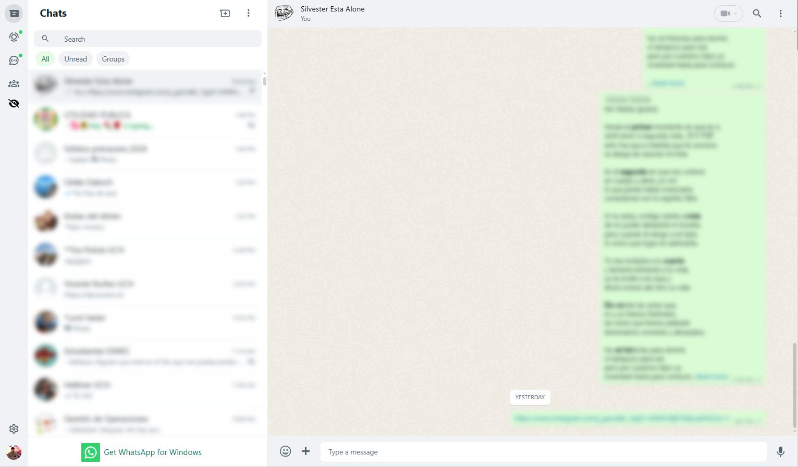

<h1><a href="https://github.com/matias-saavedra-g/whatsthat">WhatsThat</a></h1>

Extension de Chromium que difumina todos los mensajes en WhatsApp web. Tiene un botón que alterna entre el modo privacidad y normal. Desarrollado por [matias-saavedra-g](https://github.com/matias-saavedra-g/).

# Ejemplo



# Instalación de la Extensión desde GitHub

## Chrome:

1. Clonar el repositorio desde GitHub:
   ```
   git clone https://github.com/matias-saavedra-g/whatsthat.git
   ```

2. Abrir Chrome y navegar a `chrome://extensions/`.

3. Habilitar el modo desarrollador (Developer Mode) en la esquina superior derecha de la página.

4. Click en "Load unpacked" (Cargar extensión sin empaquetar), luego seleccionar la carpeta clonada de la extensión (U-Cursedn't).

5. La extensión debería cargarse y aparecer en la lista de extensiones instaladas.

## Opera:

1. Clonar el repositorio desde GitHub:
   ```
   git clone https://github.com/matias-saavedra-g/whatsthat.git
   ```

2. Abrir Opera y visitar `opera://extensions/`.

3. Click en "Load unpacked" (Cargar extensión sin empaquetar), luego seleccionar la carpeta clonada de la extensión (U-Cursedn't).

4. La extensión debería cargarse y aparecer en la lista de extensiones instaladas.

## Microsoft Edge:

1. Clonar el repositorio desde GitHub:
   ```
   git clone https://github.com/matias-saavedra-g/whatsthat.git
   ```

2. Abrir Microsoft Edge y navegar a `edge://extensions/`.

3. Habilitar el modo desarrollador (Developer Mode) en la esquina inferior izquierda de la página.

4. Click en "Load unpacked" (Cargar extensión sin empaquetar), luego seleccionar la carpeta clonada de la extensión (U-Cursedn't).

5. La extensión debería cargarse y aparecer en la lista de extensiones instaladas.
