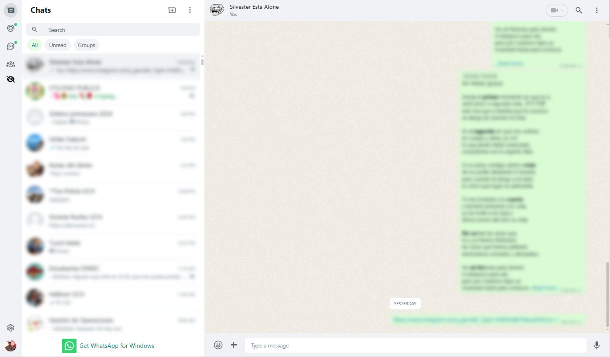
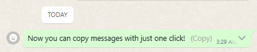

<div align="center" style="display: flex; align-items: center; justify-content: center;">
   
   <h1>
      <a href="https://github.com/matias-saavedra-g/whatsthat">
         WhatsThat
      </a>
   </h1>
</div>

Extension de Chromium que añade funciones en WhatsApp web. 

Desarrollado por [matias-saavedra-g](https://github.com/matias-saavedra-g/).

---

# Índice

- [Índice](#índice)
- [Funciones](#funciones)
  - [Difuminar mensajes](#difuminar-mensajes)
  - [Copiar mensajes](#copiar-mensajes)
- [Instalación de la Extensión desde GitHub](#instalación-de-la-extensión-desde-github)
  - [Chrome:](#chrome)
  - [Opera:](#opera)
  - [Microsoft Edge:](#microsoft-edge)

---

# Funciones

## Difuminar mensajes



### Descripción <!-- omit in toc -->

Difumina los mensajes de texto y stickers de los chats de WhatsApp web. Los mensajes difuminados se pueden ver al pasar el mouse por encima de ellos.

---

## Copiar mensajes



### Descripción <!-- omit in toc -->

Permite copiar mensajes de texto y stickers de los chats de WhatsApp web. Los mensajes copiados se pueden pegar en cualquier lugar.

---

# Instalación de la Extensión desde GitHub

## Chrome:

1. Clonar el repositorio desde GitHub:
   ```
   git clone https://github.com/matias-saavedra-g/whatsthat.git
   ```

2. Abrir Chrome y navegar a `chrome://extensions/`.

3. Habilitar el modo desarrollador (Developer Mode) en la esquina superior derecha de la página.

4. Click en "Load unpacked" (Cargar extensión sin empaquetar), luego seleccionar la carpeta clonada de la extensión (U-Cursedn't).

5. La extensión debería cargarse y aparecer en la lista de extensiones instaladas.

## Opera:

1. Clonar el repositorio desde GitHub:
   ```
   git clone https://github.com/matias-saavedra-g/whatsthat.git
   ```

2. Abrir Opera y visitar `opera://extensions/`.

3. Click en "Load unpacked" (Cargar extensión sin empaquetar), luego seleccionar la carpeta clonada de la extensión (U-Cursedn't).

4. La extensión debería cargarse y aparecer en la lista de extensiones instaladas.

## Microsoft Edge:

1. Clonar el repositorio desde GitHub:
   ```
   git clone https://github.com/matias-saavedra-g/whatsthat.git
   ```

2. Abrir Microsoft Edge y navegar a `edge://extensions/`.

3. Habilitar el modo desarrollador (Developer Mode) en la esquina inferior izquierda de la página.

4. Click en "Load unpacked" (Cargar extensión sin empaquetar), luego seleccionar la carpeta clonada de la extensión (U-Cursedn't).

5. La extensión debería cargarse y aparecer en la lista de extensiones instaladas.
